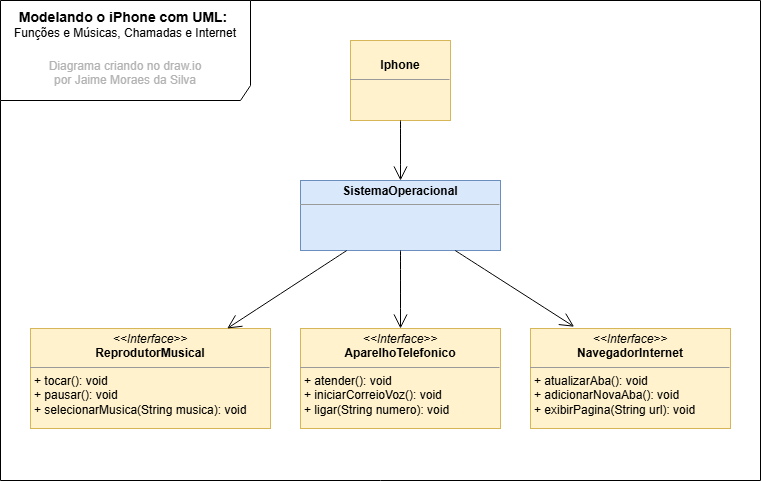

Modelagem e Diagramação de um Componente iPhone
Objetivo
Criar um diagrama UML que represente as funcionalidades descritas.

Implementar as classes e interfaces correspondentes em Java (Opcional).

Diagrama UML do projeto

Modelo Criado no draw.io

Implementando classe e interface
Foi criado as três classe para cada função do aparelho. Resolvi adcionar uma classe Sistema operacional para implementar e controlar os aplicativos.